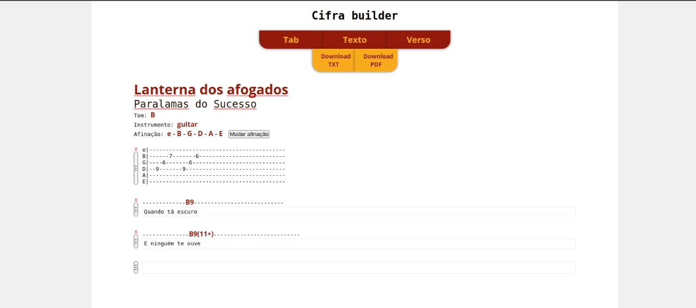
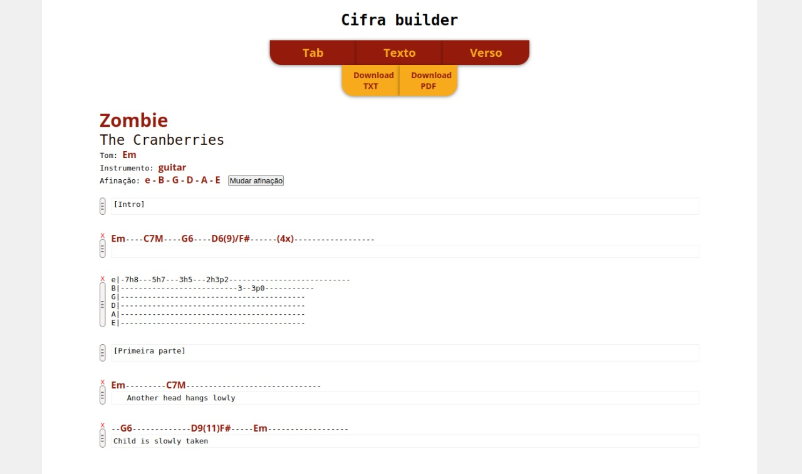
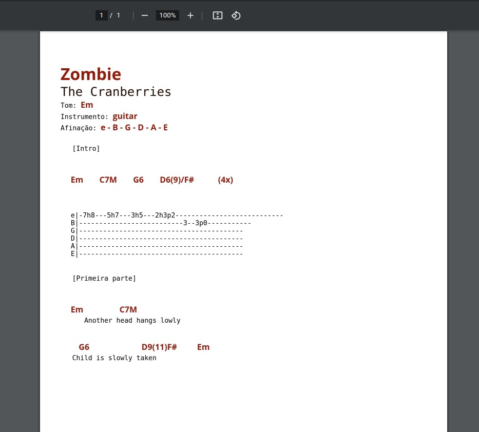

# tab builder

O Tab Builder foi criado para te ajudar a criar tabs e cifras das sua música. Você pode adicionar tab, versos, anotações e movê-las para outros lugares da música.

Ao final você pode gerar um PDF ou um TXT pronto para uso em sua pasta de músicas ou um meio eletrônico.

* Comece preenchendo os dados gerais da música, como o nome e artista
* Em seguida comece a montar sua música
* Ao final escolha um formato para geração da tab

## :clipboard: Sumário

- [Visão Geral](#visao-geral)
  - [O problema](#o-problema)
  - [Prints](#prints)
  - [Links](#links)
- [Meu processo](#meu-processo)
  - [Construção](#construcao)
  - [O que aprendi](#o-que-aprendi)
- [Futuras implementações](#futuras-implementacoes)
- [Como executar o projeto](#como-executar-o-projeto)
- [Autor](#autor)

## :telescope: Visão geral

### O problema

Sou um amante de música. Desde 2012, quando comecei a tocar violão, o meu interesse só aumentou. Em 2019 comecei a tocar em uma banda com uns amigos. Nesse meio já como guitarrista.  
  
Por ser uma banda amadora, a vida vai minando o nosso tempo, e a cada show que aparecia, a formação da banda mudava. Enfim chegou a minha vez, e tive que começar a tocar baixo.

No começo foi um choque grande, pois há uma enorme diferença no conteúdo encontrado online para violão e guitarra comparado ao que se encontra para baixo. Tive que começar a desenvolver mais o meu ouvido para começar a tirar as músicas.

Nessa de tirar de ouvido, eu precisava fazer anotações. Foi quando notei que não havia uma grande plataforma ou site para criação de tabs de forma simples, que era o que eu precisava, e de forma gratuita.

Encontrei um site que oferecia justamente isso: criação de tab de forma simples e gratuita. Porém haviam algumas limitações. Ela me serviu para o que eu queria, mas logo quis fazer a minha versão com as minhas melhorias.
  
### Prints  
  
  
  
  
  
    
### Links
 
- Projeto online: [Netlify](https://tourmaline-marigold-756eaf.netlify.app/)  
  
## :pencil2: Meu processo 
  
### Construção  
  
- Frontend:  
  - VueJs 
  - VueHtml2Pdf

### O que aprendi

Tudo que foi usado nesse projeto foi feito com Javascript relativamente simples. Com o estudo aplicado, é possível resolver muitos problemas do nosso dia-a-dia.

A geração de pdf pode ser feita pelo front, ao invés de receber uma URL do front.

Há muitos recursos acessíveis pelo front e é possível construir muita coisa utilizando apenas o front.
  

## :satellite: Futuras implementações
  
:white_medium_square: Melhorar a tela inicial. Necessário deixar mais intuitiva e clara  
:white_medium_square: Utilização da biblioteca i18n para multiplas linguagens   
:white_medium_square: Rota 404  

## :arrow_forward: Como executar o projeto

Certifique-se de ter instalado o NodeJs em sua máquina. Você pode digitar no seu terminal o comando: 
```
node -v
```
Após realizar o clone do repositório, navegue até a pasta raiz do proejto e no terminal execute o comando abaixo para as dependências serem instaladas:

```
npm install

// ou usando yarn:

yarn
```
  
Com as dependências instaladas execute o comando seguinte para executar o projeto:
```
npm run serve

// ou usando yarn

yarn serve
```
  
## :smile: Autor  
  
- Renato Novaes
  - [Linkedin](https://www.linkedin.com/in/renatonovaes49)
  - [Instagram](https://www.instagram.com/novaes_r)

## :clap: Agradecimentos  
  
* **Rafael Rodrigues** - Mestre na arte de ensino. Sempre aprendo algo novo com ele.
* **Wesley Alves** - Tirou muitas dúvidas e caminhos para o desenvolvimento de funcionalidades
* **Thiago Vilasboas** - O cara que mais entende de CSS que eu conheço
